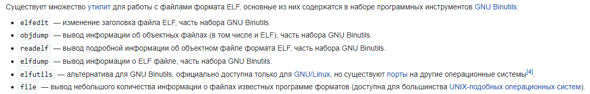

# riscv-disasm
Здесь можно найти дизассемблер, с помощью которого можно преобразовывать машинный код из elf-файла в текст программы на языке ассемблера. Поддерживаться следующий набор команд RISC-V: RV32I, RV32M, RV32A и расширения Zifence, Zihintpause. Также прилагается несколько тестов и референсов.

Для запуска можно использовать `python main.py {elf_filename} {output_filename}`.

Данные материалы созданы в рамках [Лабораторной работы курса архитектуры ЭВМ](https://docs.google.com/document/d/1YTgku__pPC0_HPIlXqQQ89iOHy6gG3d6rPLxkHzyxi4/edit).

В планах есть:
1. Избавиться от работы со строками
2. Вынести общий код для парса инструкций, имеющих одинаковый базовый формат.
3. Добавить обработку исключений.
4. Попробовать реализовать что-нибудь еще из: 
